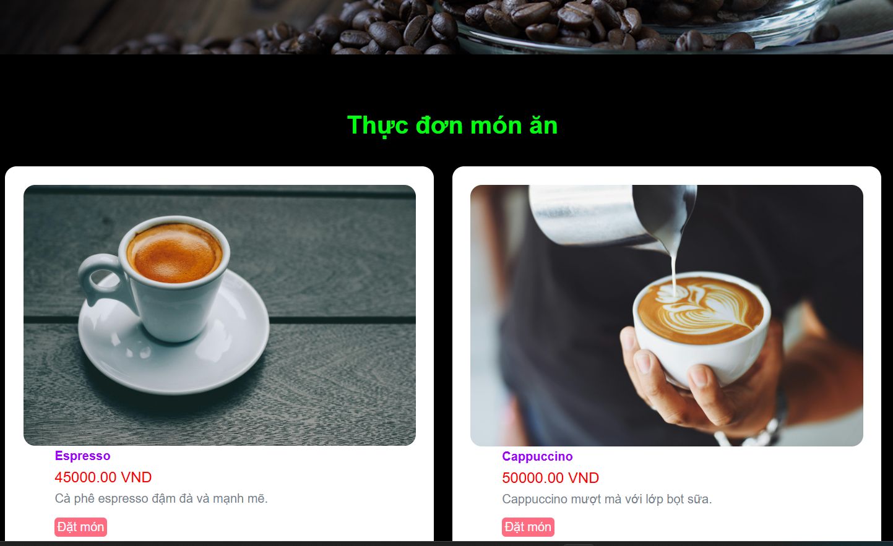

# Hệ Thống Quản Lý Quán Cafe

Đây là một ứng dụng web đơn giản viết bằng PHP dùng để quản lý quán cafe hoặc nhà hàng, bao gồm quản lý thực đơn, danh mục món ăn, đơn hàng và quản trị cho quản lý.

## Tính Năng

- Xem và quản lý danh mục món ăn
- Quản lý các món ăn cụ thể
- Quản lý đơn hàng từ khách hàng
- Giao diện quản trị (Admin) với chức năng thêm/sửa/xóa
- Giao diện người dùng đơn giản, dễ sử dụng

## Cấu Trúc Thư Mục
├── admin.php
├── categories.php
├── foods.php
├── order.php
├── index.php
├── css/
├── images/
├── partials-front/
├── vendor/
├── cafe-project.sql
├── docker-compose.yml
├── Dockerfile
├── composer.json
└── .env

## Yêu Cầu

- Cài đặt Docker & Docker Compose
- Hoặc môi trường PHP 7.4+, MySQL, Apache/Nginx

##  Cài Đặt Bằng Docker

1. **Tải mã nguồn về**
   git clone git về
   
   cd website_cafe

2. **Chạy docker compose**

docker-compose up --build -d

Docker sẽ tạo các container cho:

PHP + Apache

MySQL

3. Truy cập website
Giao diện người dùng (khách hàng):
    http://localhost:8080/

Giao diện quản trị (admin):
    http://localhost:8080/admin/login.php

Tài khoản mặc định: admin / admin

Lưu ý:
Kiểm tra cấu hình kết nối CSDL trong file .env
Nếu lỗi kết nối DB, đảm bảo container MySQL đang chạy và chờ vài giây cho DB khởi động